# BÁO CÁO ĐỒ ÁN: HỆ THỐNG HƯỚNG DẪN THUYẾT MINH VÀ QUẢN LÝ FOOD TOUR VĨNH KHÁNH

---

## 1. TỔNG QUAN HỆ THỐNG

### 1.1 Giới thiệu

**VinhKhanhFoodTour** là hệ thống hướng dẫn du lịch ẩm thực thông minh dành cho địa bàn Vĩnh Khánh, tỉnh An Giang. Hệ thống kết hợp công nghệ định vị GPS và phát thanh thuyết minh tự động để mang lại trải nghiệm tham quan các quán ăn đặc sản một cách sinh động, tiện lợi và không cần hướng dẫn viên trực tiếp.

### 1.2 Mục tiêu hệ thống

- Cung cấp nền tảng thuyết minh âm thanh tự động cho du khách khi đến gần các điểm ẩm thực (POI - Point of Interest).
- Giúp chủ quán ăn (Owner) tự quản lý nội dung quán và theo dõi mức độ tương tác.
- Cung cấp cho Admin trung tâm quản lý và phê duyệt nội dung toàn hệ thống.
- Hỗ trợ chế độ offline để đảm bảo trải nghiệm ngay cả khi mạng kém.

### 1.3 Các thành phần hệ thống

| Thành phần | Công nghệ | Vai trò |
|---|---|---|
| **Backend API** | .NET 10, ASP.NET Core, Entity Framework, PostgreSQL | Cung cấp REST API trung tâm |
| **Admin Portal** | Blazor Server, TailwindCSS | Giao diện web quản trị |
| **Mobile App** | .NET MAUI (Android/iOS) | Ứng dụng dành cho du khách |
| **Database** | PostgreSQL + NetTopologySuite (GIS) | Lưu trữ dữ liệu có tọa độ địa lý |

---

## 2. PHÂN TÍCH TÁC NHÂN (ACTORS)

Hệ thống có **3 tác nhân chính**:

| Tác nhân | Mô tả | Nền tảng |
|---|---|---|
| **Du khách (Tourist)** | Người dùng ứng dụng di động, không cần đăng nhập hoặc đăng nhập dưới dạng khách | Mobile App (iOS/Android) |
| **Chủ quán (Owner)** | Chủ sở hữu các điểm ẩm thực, đăng ký tài khoản để quản lý quán | Admin Portal (Web) |
| **Quản trị viên (Admin)** | Người vận hành hệ thống, có toàn quyền kiểm soát | Admin Portal (Web) |

---

## 3. KIẾN TRÚC HỆ THỐNG

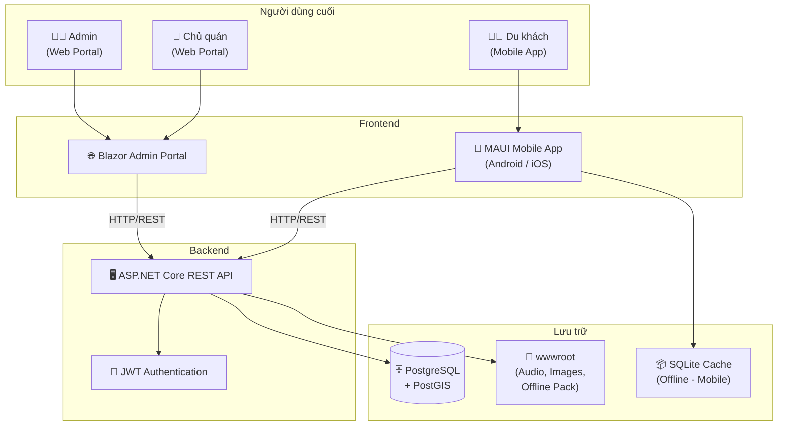

---

## 4. MÔ HÌNH DỮ LIỆU

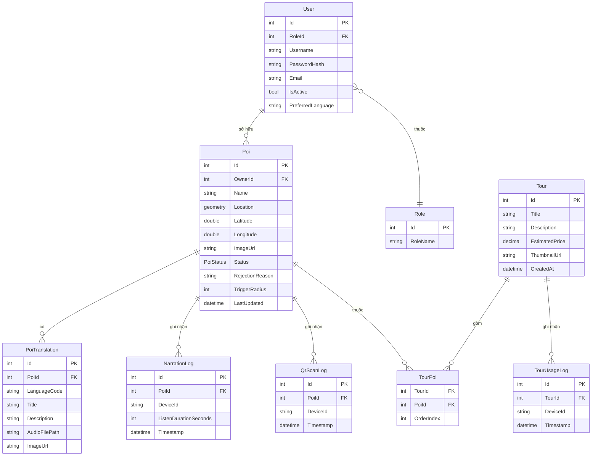

---

## 5. BIỂU ĐỒ USECASE

### 5.1 UseCase Tổng quan

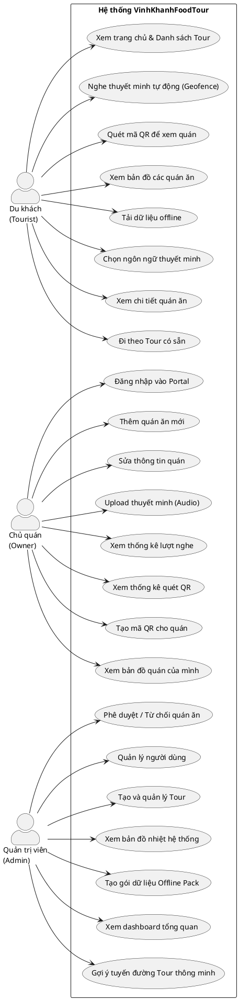

---

### 5.2 Mô tả chi tiết các Use Case

#### UC-T2: Nghe thuyết minh tự động

| Trường | Nội dung |
|---|---|
| **Tên** | Nghe thuyết minh tự động (Geofence Auto-Play) |
| **Tác nhân** | Du khách (Tourist) |
| **Điều kiện trước** | App đã bật quyền truy cập GPS; Dữ liệu POI đã được tải |
| **Luồng chính** | 1. App theo dõi GPS liên tục; 2. Phát hiện người dùng vào vùng 30m của POI; 3. Hiển thị tên quán và phát thuyết minh (MP3 hoặc TTS); 4. Ghi log lượt nghe gửi về server |
| **Luồng thay thế** | Nếu đang nghe quán A: hiện popup hỏi có muốn nghe quán B ngay không; Nếu không: đưa vào hàng chờ |
| **Điều kiện sau** | Log lượt nghe được ghi vào database; Thống kê của Owner được cập nhật |

#### UC-O1: Thêm quán ăn mới

| Trường | Nội dung |
|---|---|
| **Tên** | Thêm quán ăn mới (POI) |
| **Tác nhân** | Chủ quán (Owner) |
| **Điều kiện trước** | Owner đã đăng nhập vào Admin Portal |
| **Luồng chính** | 1. Owner nhấn "Thêm quán ăn mới"; 2. Điền thông tin tên, mô tả, tọa độ, ảnh; 3. Hệ thống lưu quán với trạng thái "Chờ duyệt"; 4. Admin nhận yêu cầu phê duyệt |
| **Điều kiện sau** | Quán được tạo ở trạng thái Pending; Admin được thông báo để phê duyệt |

#### UC-A1: Phê duyệt quán ăn

| Trường | Nội dung |
|---|---|
| **Tên** | Phê duyệt / Từ chối quán ăn |
| **Tác nhân** | Quản trị viên (Admin) |
| **Điều kiện trước** | Có quán đang ở trạng thái "Chờ duyệt" |
| **Luồng chính** | 1. Admin vào Dashboard → xem danh sách Pending; 2. Xem thông tin quán; 3. Nhấn "Duyệt" hoặc "Từ chối" + lý do; 4. Hệ thống cập nhật trạng thái và tự động tạo lại gói Offline Pack |
| **Điều kiện sau** | Quán được công khai trên App (nếu duyệt) hoặc Owner được thông báo lý do từ chối |

---

## 6. BIỂU ĐỒ SEQUENCE (TUẦN TỰ)

### SQ-01: Luồng Khởi động App và Đồng bộ Offline

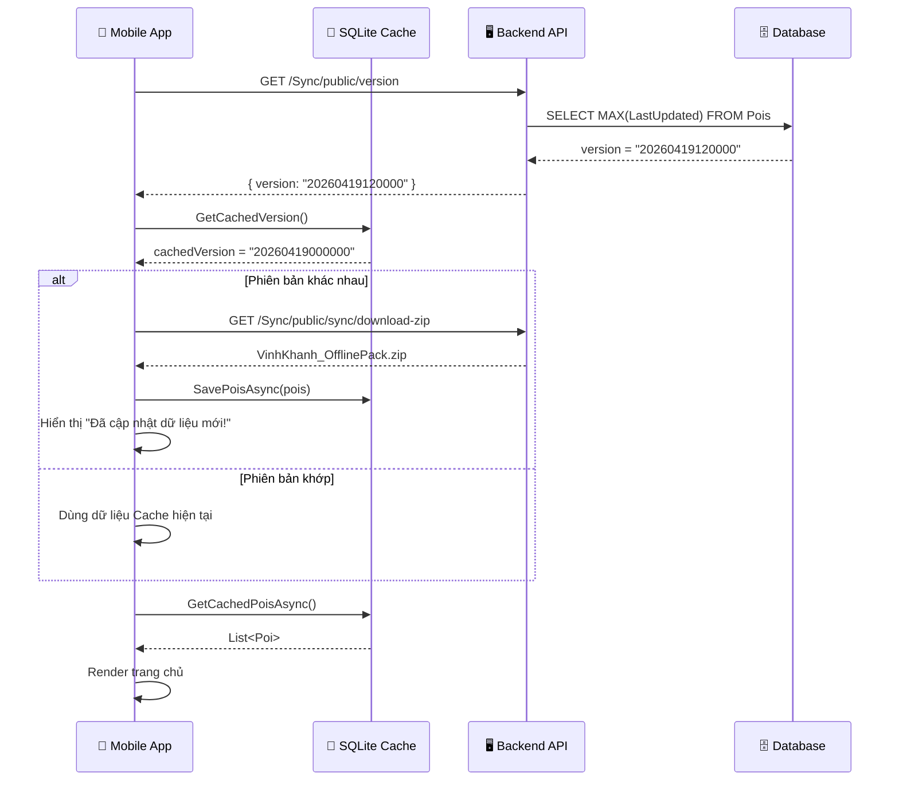

### SQ-02: Luồng Phát thuyết minh tự động (Geofence)

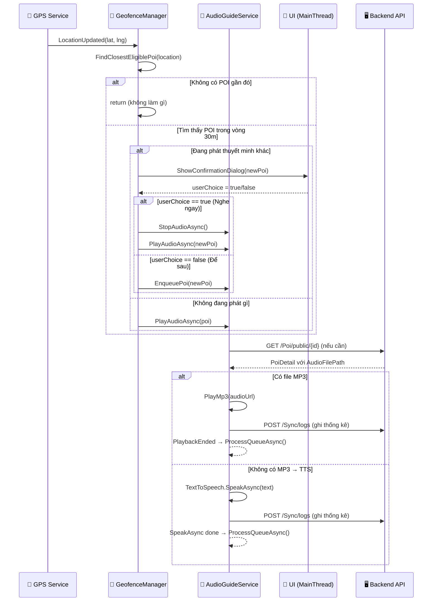

### SQ-03: Luồng Đăng nhập (Owner / Admin)

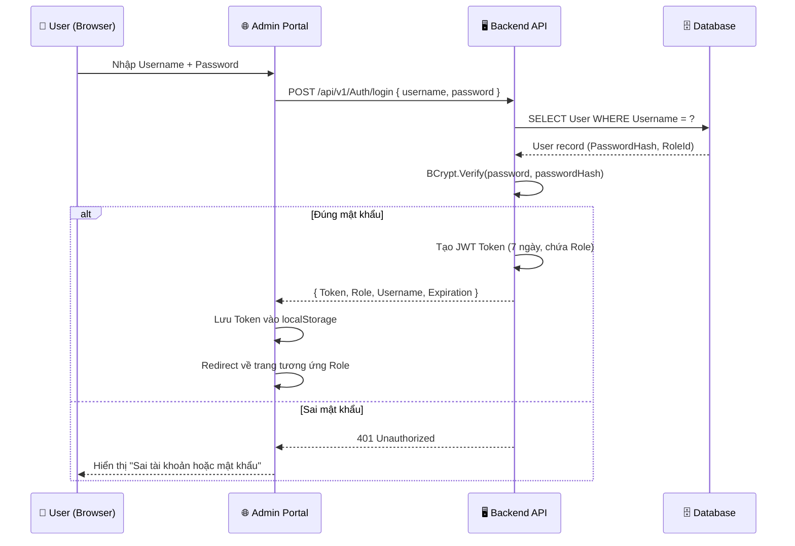

### SQ-04: Luồng Phê duyệt quán ăn (Admin)

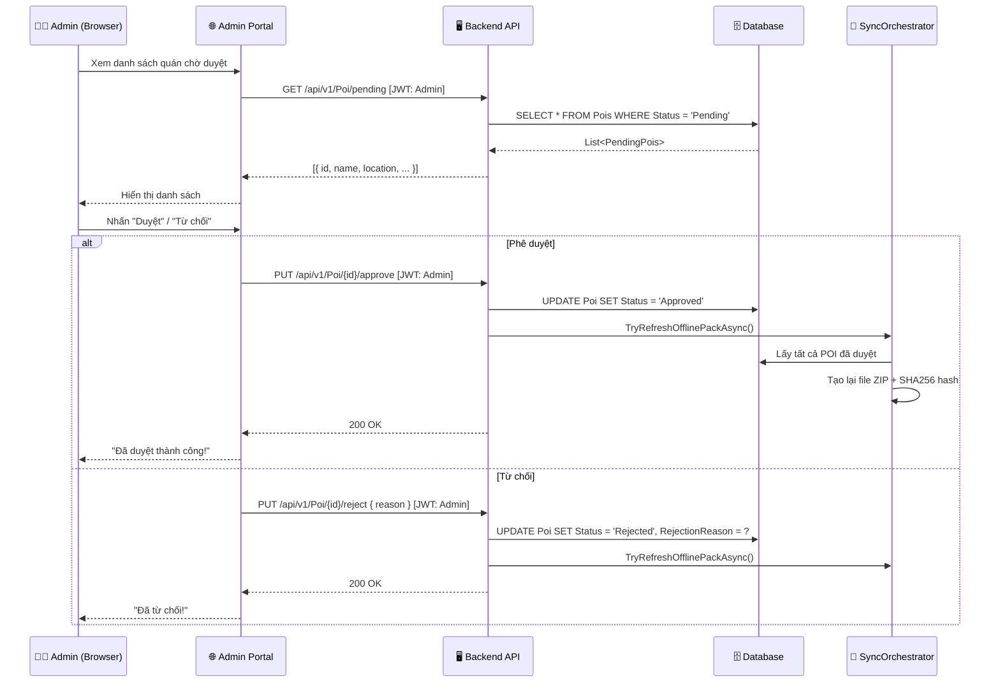

### SQ-05: Luồng Tạo Tour và Gợi ý Tuyến đường (Admin)

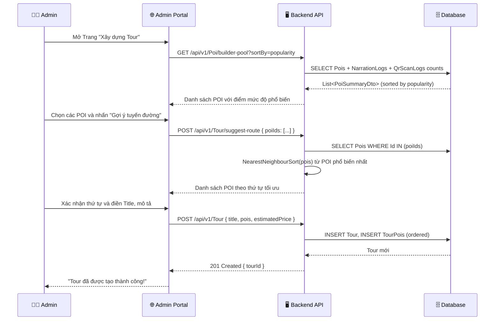

### SQ-06: Luồng Quét QR Code

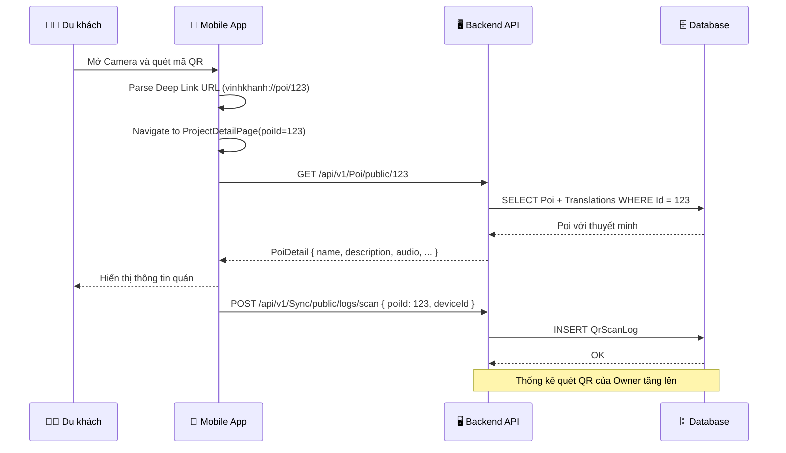

### SQ-07: Luồng Thêm Quán Ăn Mới (Owner)

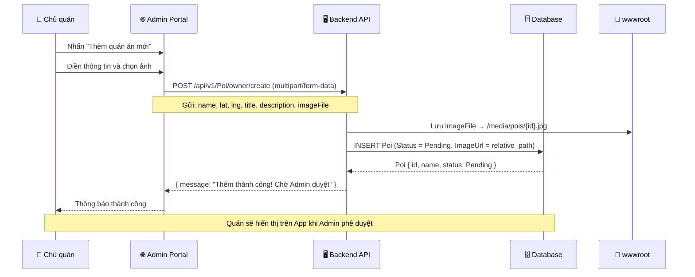

---

## 7. BIỂU ĐỒ ACTIVITY (HOẠT ĐỘNG)

### AC-01: Du khách trải nghiệm Tour

```mermaid
flowchart TD
    Start([🚀 Mở App]) --> SplashCheck{Có dữ liệu offline?}
    SplashCheck -->|Không| DownloadPack[Tải Offline Pack từ Server]
    SplashCheck -->|Có| CheckVersion{Kiểm tra phiên bản}
    DownloadPack --> SaveCache[Lưu vào SQLite Cache]
    SaveCache --> ShowHome
    CheckVersion -->|Có bản mới| DownloadPack
    CheckVersion -->|Đã mới nhất| ShowHome[Hiển thị Trang chủ]

    ShowHome --> BrowseTours[Xem danh sách Tour]
    BrowseTours --> SelectTour[Chọn một Tour]
    SelectTour --> ViewTourDetail[Xem chi tiết Tour & Bản đồ]
    ViewTourDetail --> EnableAutoPlay{Bật "Tự động thuyết minh"?}
    EnableAutoPlay -->|Có| StartGPS[Bật theo dõi GPS]
    EnableAutoPlay -->|Không| ManualMode[Chế độ tự chọn]

    StartGPS --> WalkAround((🚶 Di chuyển))
    WalkAround --> NearPoi{Trong 30m của POI?}
    NearPoi -->|Không| WalkAround
    NearPoi -->|Có| IsPlaying{Đang phát thuyết minh?}

    IsPlaying -->|Không| PlayAudio[Phát thuyết minh]
    IsPlaying -->|Có| ShowConfirm[Hiển thị hộp thoại xác nhận]

    ShowConfirm --> UserChoose{Người dùng chọn?}
    UserChoose -->|Nghe ngay| StopAndPlay[Dừng cũ, Phát mới]
    UserChoose -->|Để sau| AddQueue[Thêm vào hàng chờ]
    UserChoose -->|Timeout| AddQueue

    AddQueue --> WalkAround
    StopAndPlay --> LogStats[Ghi log thống kê]
    PlayAudio --> LogStats
    LogStats --> WalkAround
```

### AC-02: Owner quản lý nội dung quán

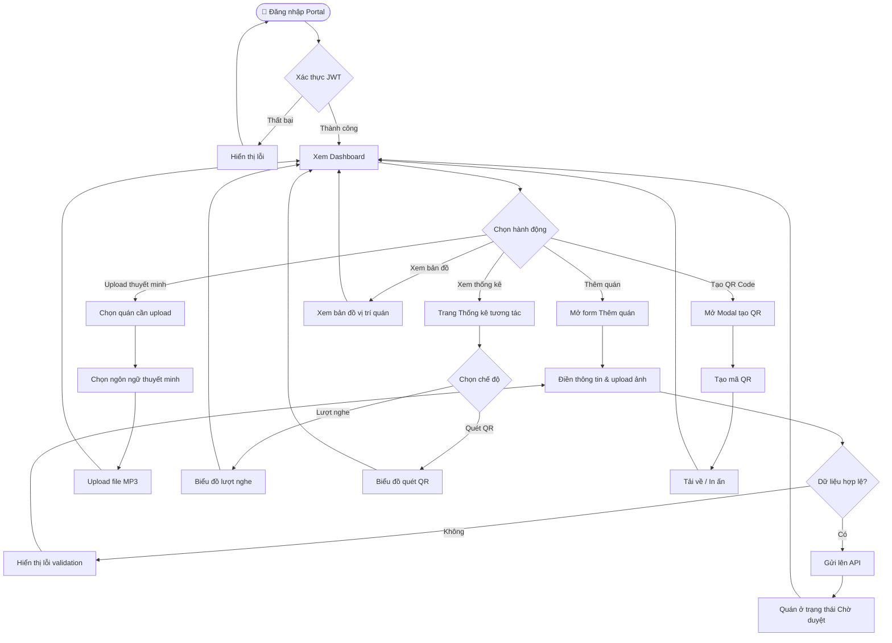

### AC-03: Admin quản lý và phê duyệt hệ thống

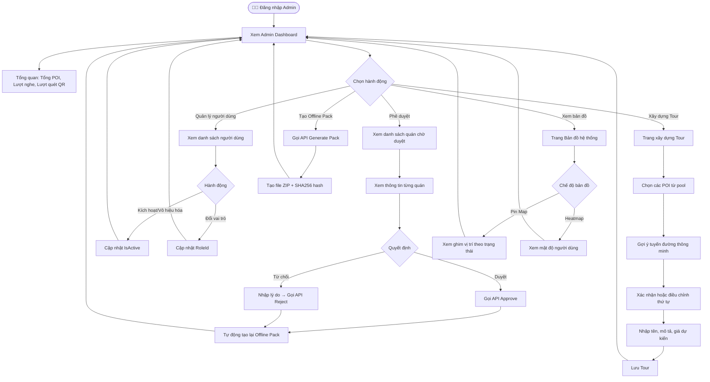

### AC-04: Luồng Đăng ký Owner và Chờ hoạt động

```mermaid
flowchart TD
    Start([🌐 Truy cập Portal]) --> ClickRegister[Nhấn "Đăng ký"]
    ClickRegister --> FillInfo[Điền Username, Email, Password]
    FillInfo --> Validate{Hệ thống kiểm tra}
    Validate -->|Username đã tồn tại| DupUser[Báo lỗi Username] --> FillInfo
    Validate -->|Email đã tồn tại| DupEmail[Báo lỗi Email] --> FillInfo
    Validate -->|Hợp lệ| HashPwd[Hash mật khẩu BCrypt]
    HashPwd --> CreateUser[Tạo User với Role = Owner]
    CreateUser --> LoginNow[Đăng nhập ngay]
    LoginNow --> GetJWT[Nhận JWT Token]
    GetJWT --> OwnerDashboard[Vào Dashboard Chủ quán]
    OwnerDashboard --> StartAdding[Bắt đầu thêm quán ăn]
```

---

## 8. API ENDPOINTS TỔNG HỢP

### 8.1 Authentication

| Method | Endpoint | Role | Mô tả |
|---|---|---|---|
| POST | `/api/v1/Auth/login` | Public | Đăng nhập bằng username/password |
| POST | `/api/v1/Auth/register` | Public | Đăng ký tài khoản Owner |
| POST | `/api/v1/Auth/guest-login` | Public | Đăng nhập dưới dạng khách (Tourist) |

### 8.2 POI (Point of Interest)

| Method | Endpoint | Role | Mô tả |
|---|---|---|---|
| GET | `/api/v1/Poi` | Public | Lấy danh sách tất cả POI đã duyệt |
| POST | `/api/v1/Poi` | Owner, Admin | Tạo POI mới (JSON) |
| GET | `/api/v1/Poi/pending` | Admin | Danh sách POI chờ duyệt |
| PUT | `/api/v1/Poi/{id}/approve` | Admin | Duyệt POI |
| PUT | `/api/v1/Poi/{id}/reject` | Admin | Từ chối POI |
| GET | `/api/v1/Poi/public/{id}` | Public | Chi tiết POI công khai |
| POST | `/api/v1/Poi/owner/create` | Owner | Tạo POI với ảnh (multipart) |
| GET | `/api/v1/Poi/owner/my-pois` | Owner | Lấy quán của mình |
| GET | `/api/v1/Poi/builder-pool` | Admin, Owner | Pool POI cho Tour Builder |
| GET | `/api/v1/Poi/overview-pins` | Admin, Owner | Ghim bản đồ tổng quan |
| GET | `/api/v1/Poi/user-heatmap` | Admin | Dữ liệu bản đồ nhiệt |
| GET | `/api/v1/Poi/map` | Public | Ghim bản đồ công khai |

### 8.3 Tour

| Method | Endpoint | Role | Mô tả |
|---|---|---|---|
| GET | `/api/v1/Tour` | Admin | Lấy danh sách Tour (Admin) |
| POST | `/api/v1/Tour` | Admin | Tạo Tour mới |
| GET | `/api/v1/Tour/public` | Public | Danh sách Tour công khai |
| PUT | `/api/v1/Tour/{id}` | Admin | Cập nhật Tour |
| DELETE | `/api/v1/Tour/{id}` | Admin | Xóa Tour |
| POST | `/api/v1/Tour/suggest-route` | Admin, Owner | Gợi ý tuyến đường thông minh |
| POST | `/api/v1/Tour/{id}/log-usage` | Public | Ghi log sử dụng Tour |

### 8.4 Sync & Statistics

| Method | Endpoint | Role | Mô tả |
|---|---|---|---|
| GET | `/api/v1/Sync/public/version` | Public | Kiểm tra phiên bản dữ liệu |
| GET | `/api/v1/Sync/public/sync/download-zip` | Public | Tải Offline Pack |
| POST | `/api/v1/Sync/admin/sync/generate-pack` | Admin | Tạo Offline Pack |
| POST | `/api/v1/Sync/logs` | Public | Ghi nhận lượt nghe thuyết minh |
| POST | `/api/v1/Sync/public/logs/scan` | Public | Ghi nhận lượt quét QR |
| GET | `/api/v1/Sync/owner/stats/listens` | Owner | Thống kê lượt nghe/quét của Owner |
| GET | `/api/v1/Sync/owner/stats/listens/trend` | Owner | Biểu đồ xu hướng 30 ngày / 12 tháng |

---

## 9. KIẾN TRÚC XỬ LÝ THUYẾT MINH (AUDIO GUIDE)

Hệ thống thuyết minh hoạt động theo mô hình **Fallback 3 Lớp** để đảm bảo luôn có âm thanh dù điều kiện mạng như thế nào:

```mermaid
flowchart TD
    A[🎯 Kích hoạt Thuyết minh] --> L1{Lớp 1: File MP3}
    L1 -->|Có file audio| B[✅ Phát file MP3\ntừ server]
    L1 -->|Không có file| L2{Lớp 2: Text-to-Speech}
    
    L2 --> L2A{Có bản dịch\nngôn ngữ đang chọn?}
    L2A -->|Có| C[✅ TTS với\ntext bản dịch có sẵn]
    L2A -->|Không| L2B{Thử Auto-dịch\ntừ tiếng Việt}
    
    L2B -->|Thành công| D[✅ TTS với\ntext đã dịch]
    L2B -->|Thất bại| L2C[✅ TTS tiếng Việt\n(Fallback an toàn)]

    B --> Log[📊 Ghi log lượt nghe]
    C --> Log
    D --> Log
    L2C --> Log
    Log --> Queue{Còn trong hàng chờ?}
    Queue -->|Có| NextPoi[⏭️ Đợi 1s → Phát quán tiếp theo]
    Queue -->|Không| End([✅ Kết thúc])
```

---

## 10. KẾT LUẬN

### 10.1 Tính năng đã triển khai

| STT | Tính năng | Trạng thái |
|---|---|---|
| 1 | Xác thực JWT (Login/Register/Guest) | ✅ Hoàn thành |
| 2 | Phát thuyết minh tự động 3 lớp | ✅ Hoàn thành |
| 3 | Hàng chờ và xác nhận thuyết minh | ✅ Hoàn thành |
| 4 | Quản lý POI (CRUD) | ✅ Hoàn thành |
| 5 | Workflow phê duyệt quán | ✅ Hoàn thành |
| 6 | Quét mã QR Deep Link | ✅ Hoàn thành |
| 7 | Tạo và quản lý Tour | ✅ Hoàn thành |
| 8 | Gợi ý tuyến đường thông minh | ✅ Hoàn thành |
| 9 | Đồng bộ dữ liệu Offline | ✅ Hoàn thành |
| 10 | Thống kê lượt nghe / quét QR | ✅ Hoàn thành |
| 11 | Bản đồ ghim vị trí | ✅ Hoàn thành |
| 12 | Bản đồ nhiệt (Heatmap - Admin only) | ✅ Hoàn thành |
| 13 | Đa ngôn ngữ thuyết minh (vi, en, ja, ko) | ✅ Hoàn thành |
| 14 | Phân quyền theo Role (Tourist/Owner/Admin) | ✅ Hoàn thành |

### 10.2 Công nghệ sử dụng

| Lớp | Công nghệ |
|---|---|
| **Mobile App** | .NET MAUI 10, CommunityToolkit.Mvvm, SQLite, Plugin.Maui.Audio |
| **Admin Portal** | Blazor Server, TailwindCSS, Chart.js, Leaflet.js |
| **Backend API** | ASP.NET Core 10, Entity Framework Core, JWT Bearer |
| **Database** | PostgreSQL 15, NetTopologySuite (GIS) |
| **Bảo mật** | BCrypt password hashing, JWT RS256, Role-based authorization |
| **Dữ liệu địa lý** | PostGIS, NetTopologySuite, MAUI Maps |
